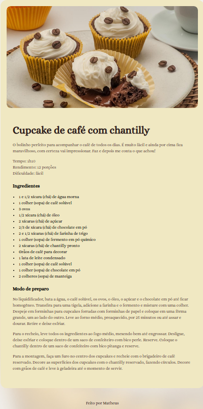

# 🍲 Página de Receita

Página web para apresentação de uma receita culinária, desenvolvida com HTML e CSS.

## 📖 Sobre

Projeto de prática de estruturação e estilização de conteúdo, exibindo ingredientes e modo de preparo de uma receita.

## 🚀 Tecnologias

- HTML5
- CSS3

## 🔗 Acesse o projeto

https://maathxx.github.io/projeto-paginadereceitas/

## 👨🏽‍💻 Autor

Desenvolvido por **[Matheus Oliveira](https://github.com/maathxx)**.

